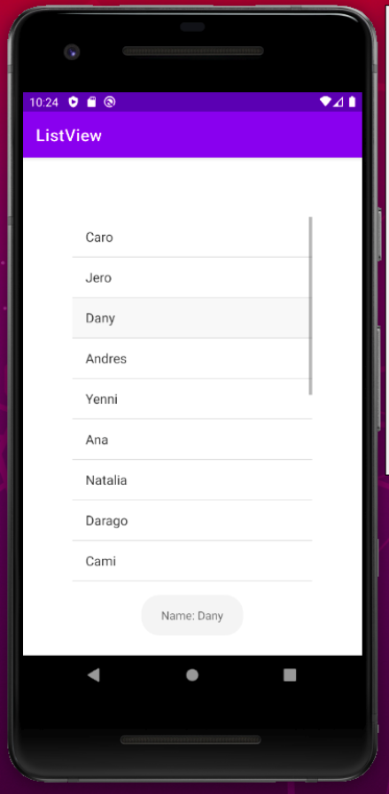

# List view

### Displays a vertically-scrollable collection of views, where each view is positioned immediately below the previous view in the list. 

## ArrayAdapter
You can use this adapter to provide views for an AdapterView, Returns a view for each object in a collection of data objects you provide, and can be used with list-based user interface widgets such as ListView or Spinner

## Resources:books:

* [List view](https://developer.android.com/reference/kotlin/android/widget/ListView)
* [Array Adapter](https://developer.android.com/reference/kotlin/android/widget/ArrayAdapter)

---

*** Note: Please, remember use these pluggins in the file build.gradle:

```
plugins {
    id 'com.android.application'
    id 'kotlin-android'
    id 'kotlin-android-extensions'
}
```
---

## Images



## Author
* **Daniela Ramirez Gomez** - [danyramirezg](https://github.com/danyramirezg)
